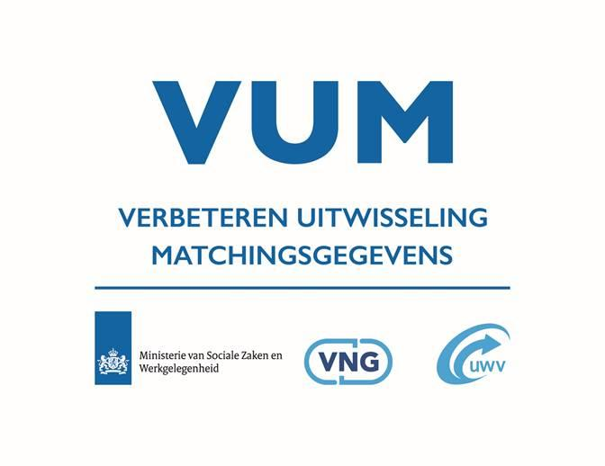
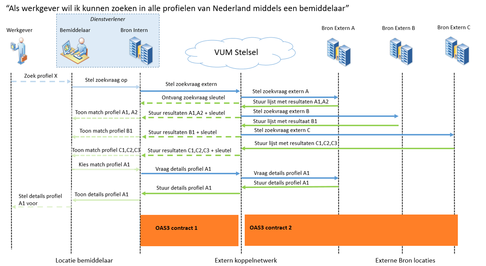

**Naast dit bestand kunt u ook de [releasenotes](./releasenotes.md) en [workflow](workflow.md) bestanden vinden. **
Releasenotes beschrijft wat de veranderingen zijn voor elke versie dat uitgebracht is, hierbij wordt ook de uitleg beschreven. 
De workflow bestand heeft een beschrijving over hoe er in dit repository gewerkt wordt.

<table align="center"><tr><td align="center" width="9999">

</td></tr></table>

**Inhoud**

[Inleiding 1](#inleiding)

> [Doel 1](#doel)
>
> [Gerelateerde documentatie 1](#gerelateerde-documentatie)
>
> [Samenhang met standaarden 2](#samenhang-met-standaarden)
>
> [Versie historie 2](#versiehistorie)

[TWI API’s: REST/JSON en OpenAPI 3](#twi-apis-restjson-en-openapi)

[Ontwerpkeuzes 3](#ontwerpkeuzes)

> [Naamgeving gegevenselementen 3](#naamgeving-gegevenselementen)
>
> [Waardelijsten 3](#waardelijsten)
>
> [Waardelijsten onderdeel van het VUM logisch gegevensmodel
> 4](#waardelijsten-onderdeel-van-het-vum-logisch-gegevensmodel)
>
> [Waardelijsten extern: SGR 4](#waardelijsten-extern-sgr)
>
> [Gegevens Domein specificaties 5](#gegevens-domein-specificaties)
>
> [Restricties en limieten 5](#restricties-en-limieten)
>
> [Interactie met VUM uitwisselingsvoorziening
> 6](#interactie-met-vum-uitwisselingsvoorziening)
>
> [Contracten 7](#contracten)
>
> [Identifiers 7](#identifiers)

[Zoekfunctionaliteit 8](#zoekfunctionaliteit)

[API’s: Algemeen 9](#apis-algemeen)

> [Header velden 9](#header-velden)
>
> [Error codes en messages 10](#error-codes-en-messages)
>
> [Security en autorisatie 10](#security-en-autorisatie)

[API: Werkzoekende Profielen 11](#api-werkzoekende-profielen)

> [Contract 1: bemiddelaar en uitwisselingsvoorziening
> 11](#contract-1-bemiddelaar-en-uitwisselingsvoorziening)
>
> [Contract 2: uitwisselingsvoorziening en bronnen
> 12](#contract-2-uitwisselingsvoorziening-en-bronnen)

[API: Vacatures 13](#api-vacatures)

> [Contract 3: bemiddelaar en uitwisselingsvoorziening
> 13](#contract-3-bemiddelaar-en-uitwisselingsvoorziening)
>
> [Contract 4: uitwisselingsvoorziening en bronnen
> 14](#contract-4-uitwisselingsvoorziening-en-bronnen)

# Inleiding

Op het TWI platform wordt de uitwisselingsvoorziening VUM gerealiseerd
en beschikbaar gesteld. De VUM-uitwisselingsvoorziening verzorgt de
uitwisseling van gestandaardiseerde gegevens over organisatiegrenzen
heen. Die uitwisseling vindt plaats tussen de bestaande systemen die
bemiddelaars gebruiken om onderling gegevens te matchen.

Dit document beschrijft een initiële versie van het koppelvlak dat
gebruikt wordt voor interactie met de uitwisselingsvoorziening door
aangesloten private en publieke partijen.

## Doel

Doel van deze koppelvlakbeschrijving is inzicht geven in de werking van
het koppelvlak, en het mogelijk maken om aan te sluiten op de
uitwisselingsvoorziening. Een belangrijk onderdeel is de API
beschrijving, die nodig is voor technisch specialisten voor realisatie
van de aansluiting vanuit de diverse systemen van aangesloten partijen.

Buiten scope van dit document zijn de aansluitvoorwaarden, die onderdeel
uitmaken van het VUM afsprakenstelsel.

## Gerelateerde documentatie

De koppelvlak beschrijving is mede gebaseerd op de volgende
documentatie:

| **Document**                         | **Versie** | **Eigenaar** | **Toelichting**                                                   |
|--------------------------------------|------------|--------------|-------------------------------------------------------------------|
| Concept VUM Solution beschrijving    | 0.8        | VUM          | Solution beschrijving incl NFE’s                                  |
| Entiteiten en attributen v0.8.4.xlsx | 0.8.4      | VUM          | Beschrijving bij entiteiten, attributen uit het gegevensmodel VUM |
| Gegevensuitwisseling Architectuur    | 1.0        | VUM          | Architectuur van de VUM gegevensuitwisseling                      |
| KSA VUM                              | 0.8        | VUM          | Keten Start Architectuur                                          |
| Het uniforme werkzoekende profiel    | 1.0        | VUM          | Specificatie van Het uniforme werkzoekende profiel                |
| De uniforme vacature-standaard       | 1.0        | VUM          | Specificatie van De uniforme vacature-standaard                   |

## Samenhang met standaarden

| **Standaard**                                                                                                                                                  | **Versie** | **Toelichting** |
|----------------------------------------------------------------------------------------------------------------------------------------------------------------|------------|-----------------|
| [<u>API Strategie Algemeen (Nederlandse API Strategie I)</u>](https://docs.geostandaarden.nl/api/API-Strategie/#api-designrules-nederlandse-api-strategie-iia) | 4-feb-2020 |                 |
| [<u>REST-API Design Rules (Nederlandse API Strategie IIa) 1.0</u>](https://publicatie.centrumvoorstandaarden.nl/api/adr/)                                      | 1.0        |                 |
| [<u>OpenAPI specification</u>](https://swagger.io/specification/)                                                                                              | 3.0        |                 |
|                                                                                                                                                                |            |                 |

## Versiehistorie

<table>
<colgroup>
<col style="width: 15%" />
<col style="width: 27%" />
<col style="width: 57%" />
</colgroup>
<thead>
<tr class="header">
<th><strong>Versie</strong></th>
<th><strong>Datum</strong></th>
<th><strong>Toelichting</strong></th>
</tr>
<tr class="odd">
<th>0.1</th>
<th>8 juni 2021</th>
<th>Initiële versie</th>
</tr>
<tr class="header">
<th>0.9</th>
<th>15 juni 2021</th>
<th>API voor Usecases Werkzoekende profiel</th>
</tr>
<tr class="odd">
<th>0.95</th>
<th>13 juli 2021</th>
<th>Aanpassingen n.a.v. reviews: o.a. codelijsten, callback</th>
</tr>
<tr class="header">
<th>0.96</th>
<th>22 juli 2021</th>
<th></th>
</tr>
<tr class="odd">
<th>0.97.0</th>
<th>11 augustus 2021</th>
<th>Technische aanpassingen aan API contract n.a.v. reviews</th>
</tr>
<tr class="header">
<th>0.98.0</th>
<th>18 augustus 2021</th>
<th>Toevoeging broncontact, verzoeken vanuit VUM: o.a. Header-velden ter
ondersteuning SaaS scenario’s</th>
</tr>
<tr class="odd">
<th>0.98.1</th>
<th>23 augustus 2021</th>
<th>Verwerken eerste feedback</th>
</tr>
<tr class="header">
<th>0.99.0</th>
<th>13 september 2021</th>
<th>Verwerken aanvullende feedback</th>
</tr>
<tr class="odd">
<th>0.99.1</th>
<th>21 september 2021</th>
<th>Toevoegen twee contracten voor Vacatures</th>
</tr>
<tr class="header">
<th>0.99.2</th>
<th>30 september 2021</th>
<th>Aanpassingen in contracten tbv pilots (o.a. datatype vumID)</th>
</tr>
<tr class="odd">
<th>0.99.3</th>
<th>4 oktober 2021</th>
<th>Correctie in VUM-Bron-Vacatures contract: vumID vervangen door
idVacature</th>
</tr>
<tr class="header">
<th>0.99.4</th>
<th>15 november 2021</th>
<th>Aanpassing datatype van een aantal ID’s, toevoegen adresgegevens bij
werkgever bij Vacature contracten</th>
</tr>
<tr class="odd">
<th>0.99.5</th>
<th>16 november 2021</th>
<th>Aanpassing in contacten, response van matches endpoint in
VUM-Bron-WerkzoekendeProfielen-0.99.5.yaml, correcte wijze van beperking
Integer waarden</th>
</tr>
<tr class="header">
<th>0.99.6</th>
<th>22 december 2021</th>
<th>
Verbeterde ondersteuning voor VUM API door beroepsnaam en
opleidingsnaam een extra object te geven. 64bit Integers gewijzigd naar
string.

Maximale waarde van straal is hoger gesteld.

Yaml veld bemiddelingspostcode heeft een example.
</th>
</tr>
<tr class="odd">
<th>0.99.7</th>
<th>15 februari 2022</th>
<th>Postcode en Straal velden verwijderd uit het zoekopdracht voor
Vacature en WerkzoekendeProfielen.</th>
</tr>
<tr class="header">
<th>0.99.7</th>
<th>15 februari 2022</th>
<th>Mobiliteit object en velden bemiddelingspostcode &amp;
maximaleReisafstand binnen het mobiliteits object verplicht gemaakt
t.b.v. geomatching op bronnen en filteren van resultaten door
bronnen.</th>
</tr>
<tr class="odd">
<th>1.0.0</th>
<th>23 mei 2022</th>
<th>Versie 1.0.0</th>
</tr>
</thead>
<tbody>
</tbody>
</table>

# TWI API’s: REST/JSON en OpenAPI

Op het TWI platform is REST/JSON de belangrijkste standaard voor
communicatie met afnemers van het platform.

De API’s binnen deze VUM koppelvlak specificatie zijn gedocumenteerd
middels contracten die voldoen aan de OpenAPI 3.0 (OAS3) standaard,
waarmee de REST/JSON communicatie wordt gespecificeerd. Zowel aanbieder
als consument van een service gebruiken zo’n contract als basis voor de
communicatie. Een OAS3 contract stelt twee partijen in staat om
afzonderlijk van elkaar het contract te implementeren.

# Ontwerpkeuzes

Bij deze koppelvlak specificatie zijn een aantal ontwerpkeuzes gemaakt
die invloed hebben op de OpenAPI contracten.

## Naamgeving gegevenselementen

Voor de naamgeving van attributen zijn de namen uit de gegevensmodellen
van VUM als basis gebruikt, met een aantal aanpassingen om ze geschikt
te maken voor toepassing in het OAS3 contract. Zo zijn bijvoorbeeld
spaties en bijzondere tekens verwijderd. De attributen blijven verder
goed leesbaar en te relateren aan het gegevensmodel en het uniforme
Werkzoekende Profiel en de uniforme Vacature standaard.

## Waardelijsten

De waardelijsten die van toepassing zijn op een aantal attributen bij
entiteiten uit de gegevensmodellen voor Werkzoekende Profielen en
Vacatures kunnen afkomstig zijn van diverse bronnen: het gaat om
opgesomde waardelijsten die onderdeel van het logisch gegevensmodel VUM
uitmaken, en deels om verwijzingen naar externe waardelijsten.
Waardelijsten kunnen een eenvoudige codering van Ja(1) en Nee (2)
bevatten maar ook coderingen voor landen, gedragscompetenties en
opleidingsnamen.

Er is voor gekozen om deze waardelijsten niet ‘hard’ in de OAS3 API
specificaties op te nemen. Dat wil zeggen dat door het contract niet
wordt afgedwongen dat correcte waarden uit een waardenlijst worden
gebruikt bij bepaalde attributen. Een reden hiervoor is dat deze
waardelijsten aan verandering onderhevig kunnen zijn, er kunnen codes
bijkomen en verwijderd worden.

### Waardelijsten onderdeel van het VUM logisch gegevensmodel

Voor een aantal attributen is in het logisch gegevensmodel een
waardelijst gespecificeerd. In de twee documenten *Het uniforme
werkzoekende profiel* en *De uniforme vacature-standaard* staan de
vermeldingen naar de betreffende waardelijsten opgenomen.

### Waardelijsten extern: SGR

De SGR is een overkoepelende gegevensstandaard voor het Suwi domein, die
o.a waardelijsten omvat om op gestandaardiseerd gegevens te kunnen
vastleggen. Deze waardelijsten binnen de SGR zijn afkomstig van diverse
norminstanties, en kunnen op uiteenlopende zaken betrekking hebben.

De waardelijsten die onderdeel uitmaken van de SGR worden door BKWI
gepubliceerd in een verzamelbestand (Excel) met de naam *Codelijsten
SuwiML* die is te downloaden van de website van BKWI. Op het moment van
schrijven wordt het bestand aangeboden via deze pagina:

[<u>https://www.bkwi.nl/producten/suwinet-services/suwinet-standaarden/suwi-gegevensregister-sgr/downloads/</u>](https://www.bkwi.nl/producten/suwinet-services/suwinet-standaarden/suwi-gegevensregister-sgr/downloads/)

In dit totaaloverzicht kan op basis van de naam van de betreffende
codelijst de lijst met toegestane waarden en hun duiding worden
opgezocht. Een voorbeeld: In het totaaloverzicht hieronder heeft
codetabel met aanduiding *CdGedragscompetentie* acht mogelijke code
waarden, met de betekenis ervan.

| **codelijst**        | **code** | **omschrijving**                    |
|----------------------|----------|-------------------------------------|
| CdGedragscompetentie | 24100    | Beslissen en activiteiten initiëren |
| CdGedragscompetentie | 24101    | Aansturen                           |
| CdGedragscompetentie | 24102    | Begeleiden                          |
| CdGedragscompetentie | 24104    | Aandacht en begrip tonen            |
| CdGedragscompetentie | 24105    | Samenwerken en overleggen           |
| CdGedragscompetentie | 24106    | Ethisch en integer handelen         |
| CdGedragscompetentie | 24100    | Beslissen en activiteiten initiëren |
| CdGedragscompetentie | 24101    | Aansturen                           |
| …                    |          |                                     |
| CdGemeenteGba        | 0        | Onbekend                            |
| CdGemeenteGba        | 1        | Adorp                               |

## Gegevens Domein specificaties

De OpenAPI 3.0 standaard biedt mogelijkheden om gegevenstypen voor
attributen vast te leggen. Deze mogelijkheden zijn echter niet zo
uitgebreid als bijvoorbeeld bij een XML schema definitie. Veel
attributen zijn als eenvoudige datatypen (string, integer etc)
vastgelegd, met daarbij waar nodig een verbijzondering in de vorm van
een format (bijv. de beperking tot een minimum en maximum waarde voor
een integer, of beperking van de lengte van een string).

De gegevensdomeinen uit het informatiemodel, en de daar aan gekoppelde
datatypen zijn vertaald naar deze eenvoudige datatypen.

## Restricties en limieten

Voor de interactie met de uitwisselingsvoorziening zijn er limieten,
bijvoorbeeld voor het maximum aantal op te vragen Werkzoekende Profielen
op basis van matches. Dergelijke limieten zijn niet ingebouwd in de OAS3
contracten, omdat deze grotendeels configureerbaar worden binnen de
uitwisselingsvoorziening, en harde limitieten in het contract de
configureerbaarheid zouden beperken.

Hieronder een aantal voorbeelden van dergelijke limieten en restricties
die configureerbaar worden binnen de uitwisselingsvoorziening (zie
document “Concept VUM solution beschrijving 0.8”).

| **Limiet/restrictie**                                                         | **Omschrijving**                                                                                                                                                                           |
|-------------------------------------------------------------------------------|--------------------------------------------------------------------------------------------------------------------------------------------------------------------------------------------|
| Responsetijd voor opvragen van een (detail-) werkzoekendeprofiel bij een bron | Bemiddelaar dient binnen 10 seconden antwoord te ontvangen op het opvragen van een werkzoekendeprofiel.                                                                                    |
| Maximaal 10 matchingprofielen opvragen per set matchingprofielen              | Nadat op een zoekvraag een set matchingprofielen is ontvangen, mag per matchingprofiel een compleet werkzoekendeprofiel worden opgevraagd, met een maximum van 10 werkzoekendednprofielen. |
| Bronhouder retourneert maximaal 100 matchingprofielen bij een zoekvraag       | Elke aangesloten bron retourneert maximaal 100 matchingprofielen bij een zoekvraag die vanaf de uitwisselingsvoorziening wordt ontvangen.                                                  |

## Interactie met VUM uitwisselingsvoorziening

Mede op basis van de TWI POC voor VUM is als bevragingspatroon van de
VUM uitwisselingsvoorziening gekozen voor een asynchrone beantwoording
van (zoek)bevragingen door de bemiddelaar. Dit wordt aangeduid als het
Baseline+ scenario. Asynchroon wil hier zeggen dat niet alle antwoorden
van alle relevante bronnen op een zoekvraag gecombineerd worden
teruggegeven in een enkele response, maar dat de bemiddelaar apart
antwoord krijgt per bron van eventuele matches. Hieronder is de
interactie voor Werkzoekende Profielen weergegeven.

Om het asynchrone Baseline+ scenario te ondersteunen wordt gebruik
gemaakt van een callback mechanisme. Bij een bevraging door de
bemiddelaar (middels de /werkzoekendeProfielen/matches endpoint in
contract 1) geeft de bemiddelaar in zijn aanroep een URL van een
endpoint mee waar resultaten op kunnen worden teruggemeld door de
uitwisselingsvoorziening.

In het sequence diagram hierboven is het betreffende endpoint voor deze
asynchrone bevraging onderdeel van contract 1.

De bemiddelaar moet hiertoe dit endpoint realiseren in de vorm van een
service die kan worden aangeroepen vanuit de uitwisselingsvoorziening.

Een zoekvraag kan dus resulteren in een aantal aanroepen vanaf de
uitwisselingsvoorziening naar de callback endpoint van de bemiddelaar.

Contract 2 is een contract met synchrone endpoints dat geïmplementeerd
wordt door de bronnen en wordt aangeroepen vanaf de
uitwisselingsvoorziening.

In versie 0.99.1 zijn naast de twee contracten voor Werkzoekende
profielen ook twee contracten voor het bevragen van Vacatures
toegevoegd.

## Contracten

<table>
<colgroup>
<col style="width: 50%" />
<col style="width: 50%" />
</colgroup>
<thead>
<tr class="header">
<th><strong>Contract bestand</strong></th>
<th><strong>Omschrijving</strong></th>
</tr>
<tr class="odd">
<th>VUM-Bemiddelaar-WerkzoekendeProfielen-1.0.0.yaml</th>
<th>Contract tussen VUM uitwisselingsvoorziening en bemiddelaar voor
bevragen van Werkzoekende profielen, inclusief callback specificatie
voor endpoint /werkzoekendeProfielen/matches 
(Contract 1 in bovenstaand diagram)</th>
</tr>
<tr class="header">
<th>VUM-Bron-WerkzoekendeProfielen-1.0.0.yaml</th>
<th>Contract tussen VUM uitwisselingsvoorziening en bronnen voor
bevragen van Werkzoekende profielen, met synchrone endpoints 
(Contract 2 in bovenstaand diagram)</th>
</tr>
<tr class="odd">
<th>VUM-Bemiddelaar-Vacatures-1.0.0.yaml</th>
<th>Contract tussen VUM uitwisselingsvoorziening en bemiddelaar voor
bevragen van Vacatures, inclusief callback specificatie voor endpoint
/vacatures/matches 
(contract 3, niet in bovenstaand diagram dat betrekking heeft op
Werkzoekende Profielen, analoog qua opzet aan contract 1)</th>
</tr>
<tr class="header">
<th>VUM-Bron-Vacatures-1.0.0.yaml</th>
<th>Contract tussen VUM uitwisselingsvoorziening en bronnen voor
bevragen van Vacatures, met synchrone endpoints 
(contract 4, niet in bovenstaand diagram dat betrekking heeft op
Werkzoekende Profielen, analoog qua opzet aan contract 2)</th>
</tr>
</thead>
<tbody>
</tbody>
</table>

## Identifiers

Binnen de uitwisselingsvoorziening is sprake van diverse identifiers,
bijvoorbeeld voor een bron, of een match. In de API specificatie is
gepoogd om de VUM terminologie daarbij te volgen. Zo heet de
identificatie van een gevonden match het vumID. De sleutel die hierboven
in het sequence diagram is benoemd met ‘zoekvraag sleutel’ heeft in het
contract de naam ‘vraagID’.

Onderstaande lijst met identifiers zoals gedefinieerd door VUM, gelinkt
aan de aanduiding in de contracten.

<table>
<colgroup>
<col style="width: 19%" />
<col style="width: 24%" />
<col style="width: 55%" />
</colgroup>
<thead>
<tr class="header">
<th><strong>VUM identifier</strong></th>
<th><strong>Naam in Contracten</strong></th>
<th><strong>Definitie</strong></th>
</tr>
<tr class="odd">
<th>Vraag-ID</th>
<th>vraagID 
(String100)</th>
<th>Het ID dat door de uitwisselingsvoorziening wordt gegenereerd bij de
ontvangst van een vraag voor matchingsprofielen of
vacature-matchingsprofielen. Het vraag ID wordt aan de uitvragende
bemiddelaar terug geleverd zodat deze de te ontvangen matchingsprofielen
van verschillende bronnen aan de juiste vraag kan koppelen.</th>
</tr>
<tr class="header">
<th>Bron-ID</th>
<th>bronID 
(String200)</th>
<th>Het ID waaronder de verschillende bronnen binnen de
uitwisselingsvoorziening bekend zijn. Wordt door de
uitwisselingsvoorziening toegekend. Wordt vastgelegd in het
bronnen-adressenboek.</th>
</tr>
<tr class="odd">
<th>Bron-profielID</th>
<th>idWerkzoekende 
(String200, wijkt af van model)</th>
<th>Het ID dat door de Bron <u>per (matchings)profiel</u> aan de
uitwisselingsvoorziening wordt meegeleverd. Het is een door de bron zelf
gebruikte/gegenereerde ID deze wordt dus niet door de
uitwisselingsvoorziening gegenereerd. Verschillende bronnen kunnen in
theorie gelijke bron-profielID’s gebruiken.</th>
</tr>
<tr class="header">
<th>Bron-vacatureID</th>
<th>idVacature 
(String200, wijkt af van model)</th>
<th>Het ID dat door de Bron <u>per (matching)vacature</u> aan de
uitwisselingsvoorziening wordt meegeleverd. Het is een door de bron zelf
gebruikte/gegenereerde ID deze wordt dus niet door de
uitwisselingsvoorziening gegenereerd. Verschillende bronnen kunnen in
theorie gelijke bron-vacatureID’s gebruiken.</th>
</tr>
<tr class="odd">
<th>VUM-ID</th>
<th>vumID 
(String500)</th>
<th>Het VUM-ID wordt door de uitwisselingsvoorziening gegenereerd. Het
is een pseudonimisering van de combinatie bron-ID en
bron-profielID/bron-vacatureID. Een door een bron geleverd
matchingsprofiel wordt door de uitwisselingsvoorziening van dit VUM-id
voorzien en hiermee geleverd aan de uitvragende bemiddelaar. Wanneer een
bemiddelaar van een ontvangen matchingsprofiel aan de
uitwisselingsvoorziening het detailprofiel uitvraagt zal de voorziening
aan de hand van het VUM-ID bepalen welke bron voor welk profiel moet
worden uitgevraagd.</th>
</tr>
</thead>
<tbody>
</tbody>
</table>

# Zoekfunctionaliteit

Voor het zoeken naar matches dienen zoekcriteria te worden opgegeven.
Verplichte onderdelen daarvan zijn een postcode en een straal om die
postcode heen. De exacte functionaliteiten die de VUM
uitwisselingsvoorziening hiervoor moet gaat bieden zijn nog niet
gespecificeerd.

De API’s bieden op dit moment de mogelijkheid om een zoekobject met
matchingparameters op te geven ter ondersteuning van het matchingproces.
Hiermee is in principe een eenvoudige zoekvraag op te stellen. De wijze
waarop dit zoekobject wordt gebruikt om te komen tot matches, is op dit
moment niet gespecificeerd als onderdeel van het koppelvlak.

De requirements en het ontwerp van zoekfunctionaliteiten vanuit VUM
bepalen hoe dit zoekmechanisme vorm gaat krijgen.

#  

# API’s: Algemeen

We bespreken hieronder de API voor Werkzoekende Profielen, en de API
voor Vacatures. Omdat er een aantal algemene kenmerken zijn die voor
beide API’s van toepassing zijn, benoemen we die eerst.

## Header velden

Enkele meta-gegevens worden meegegeven in HTTP header-velden. Hieronder
zijn deze benoemd. Motivatie om deze op te nemen is o.a. ondersteuning
van logging en diagnose, en ondersteuning bij routering in geval van
eventuele toekomstige encryptie van de bericht-inhoud. VUM garandeert
dat voor de ontvanger van een bericht de velden ‘X-VUM-fromParty’,
‘X-VUM-toParty’ en ‘X-VUM-viaParty’ correcte waarden hebben.

<table>
<colgroup>
<col style="width: 31%" />
<col style="width: 68%" />
</colgroup>
<thead>
<tr class="header">
<th><strong>Parameter</strong></th>
<th><strong>toelichting</strong></th>
</tr>
<tr class="odd">
<th>X-VUM-fromParty</th>
<th>
Aanduiding voor de verzender (OIN*) van een request of
response

Ter ondersteuning van routering (moet nader gespecificeerd
worden)
</th>
</tr>
<tr class="header">
<th>X-VUM-toParty</th>
<th>
Aanduiding voor de ontvanger (OIN*) van een request of
response

Ter ondersteuning van routering (moet nader gespecificeerd
worden)
</th>
</tr>
<tr class="odd">
<th>X-VUM-viaParty</th>
<th>
Aanduiding voor de tussenpartij (OIN* van broker/SaaS
leverancier)

Ter ondersteuning van routering (moet nader gespecificeerd
worden)
</th>
</tr>
<tr class="header">
<th>X-VUM-berichtversie</th>
<th>Aanduiding van de versie. Op verzoek van VUM is dit opgenomen als
(mogelijk) alternatief voor versionering op API-nivo (door middel van
versienummers in de URL van de endpoints)</th>
</tr>
<tr class="odd">
<th>X-VUM-vraagID</th>
<th>Bij de aanroep van de callback URL van de bemiddelaar worden het
vraagID geretourneerd als onderdeel van het response object, maar ook in
dit header veld. Doel is om het ID ook ter beschikking te hebben als de
body in de toekomst versleuteld gaat worden, bijvoorbeeld met een SaaS
tussenpartij.</th>
</tr>
<tr class="header">
<th>X-VUM-SUWIparty</th>
<th>In contact 2 tussen bron en uitwisselingsvoorziening kan voor de
bron relevant zijn of de bemiddelaar een SUWI partij is of niet. Mee te
geven bij de aanroep vanuit de uitwisselingsvoorziening.</th>
</tr>
</thead>
<tbody>
</tbody>
</table>

\*OIN: Organisatie-identificatienummer zoals gedefinieerd door Logius

## Error codes en messages

In de OpenAPI contracten voor werkzoekendeprofielen zijn een aantal door
de Internet Assigned Numbers Authority (IANA) gestandaardiseerde HTTP
status codes aan de responses gekoppeld. In de response met een aantal
van die codes status codes kunnen in de body specifiek voor VUM
aanvullend een errorcode, een error-message en error-details opgegeven
worden volgens de structuur van schema definitie
\#/components/schemas/Error die de volgende attributen bevat:

-   Code (verplicht: vaste waarde uit onderstaande tabel)

-   Message (verplicht: vaste waarde uit onderstaande tabel)

-   Details (optioneel: vrij in te vullen, human-readable tbv duiding en
    > troubleshooting)

Hieronder een initiële opzet voor de vulling en de betekenis van de
velden errorcode en errormessage voor de VUM uitwisselingsvoorziening.
Nadere uitsplitsing en aanvulling is tijdens de pilot fase voorzien.

| **HTTP status code**        | **Error code veld** | **Error message veld**                           | **Details veld (voorbeeld)**                                                                                      |
|-----------------------------|---------------------|--------------------------------------------------|-------------------------------------------------------------------------------------------------------------------|
| 400 (bad request)           | 400.01              | Ongeldige aanroep                                | Request object heeft niet juiste structuur                                                                        |
| 400 (bad request)           | 400.02              | Onvolledige aanroep                              | De verplichte velden in de request zijn niet gevuld                                                               |
| 429 (Too many requests)     | 429.01              | Aantal werkzoekendeProfielen limiet overschreden | De geconfigureerde limiet voor het opvragen van werkzoekendeprofielen op basis van een zoekvraag is overschreden. |
| 500 (internal server error) | 500.1               | Interne serverfout                               | Database timeout                                                                                                  |
| 503 (service unavailable)   | 500.3               | Service niet beschikbaar                         | Door onderhoud is deze bron tijdelijk niet bevraagbaar                                                            |

## 

## Security en autorisatie

Communicatie via de uitwisselingsvoorziening tussen publieke partijen
over het Diginetwerk wordt beveiligd en met PKI-overheid certificaten.

Autorisatie wordt gedaan op basis van het OIN dat is opgenomen in het
betreffende PKI-overheid certificaat, in combinatie met het OIN in de
header-velden om verzendende en ontvangende partij mee aan te duiden.

# 

# API: Werkzoekende Profielen

De Werkzoekende Profiel gegevens die gaan worden uitgewisseld binnen de
VUM uitwisselingsvoorziening zijn gedefinieerd in het document **Het
uniforme werkzoekende profiel v1.0**

Dit profiel bevat 71 afzonderlijk gedefinieerde gegevenselementen,
waarvan een subset van 43 gegevens het Matchingprofiel vormen.

De structuur van het matchingprofiel wordt in de API gebruikt om
zoekcriteria op te geven (request), en om matching-profielen te
retourneren (response).

Het vumID wordt gebruik bij het opvragen van details van een match.

## Contract 1: bemiddelaar en uitwisselingsvoorziening

Deze API heeft twee endpoints, en een callback specificatie, die
hieronder zijn benoemd. De matches op de matches vraag worden niet in de
response teruggegeven, maar via een callback door de
uitwisselingsvoorziening naar de bemiddelaar teruggemeld.

| **Endpoint**                   | **Request**                                                                                                                    | **Type**                                                       | **Response**                                                                                              |
|--------------------------------|--------------------------------------------------------------------------------------------------------------------------------|----------------------------------------------------------------|-----------------------------------------------------------------------------------------------------------|
| /werkzoekendeProfielen/matches | Een gevuld JSON object met de structuur van een MatchingProfiel, met een callback URL om de matches asynchroon op te ontvangen | Synchroon (submitten van de vraag)                             | vraagID in body van response, dat later gematcht kan worden met de vraagID die in de callbacks terugkomt. |
| {callback URL van bemiddelaar} | Een lijst met gevulde JSON object met de structuur van een MatchingProfiel, afkomstig van 1 bron                               | Asynchrone callback (per bron een aanroep met een set matches) | OK (bevestiging aan de uitwisselingsvoorziening)                                                          |
| /werkzoekendeProfielen/{vumID} | één vumID afkomstig uit de response van de matches endpoint                                                                    | Synchroon                                                      | Het complete Werkzoekende Profiel bij de opgegeven vumID.                                                 |

Opmerking met betrekking tot het endpoint /werkzoekendeProfielen/{vumID}
is dat het opgevraagde vumID gelogd zou kunnen worden door proxy of
firewall omdat het onderdeel uitmaakt van de URL. Dit ID is echter
anoniem, en niet te herleiden tot een brongegeven.

## Contract 2: uitwisselingsvoorziening en bronnen

Deze API heeft twee endpoints die hieronder zijn benoemd. De matches op
de /matches vraag worden hier direct in de response teruggegeven omdat
het contract dient voor bevraging van 1 bron.

| **Endpoint**                                | **Request**                                                          | **Type**  | **Response**                                                       |
|---------------------------------------------|----------------------------------------------------------------------|-----------|--------------------------------------------------------------------|
| /werkzoekendeProfielen/matches              | Een gevuld JSON object met de structuur van een MatchingProfiel.     | Synchroon | Een set matches afkomstig van deze bron                            |
| /werkzoekendeProfielen/{ {idWerkzoekende} } | één idWerkzoekende afkomstig uit de response van de matches endpoint | Synchroon | Het complete Werkzoekende Profiel bij de opgegeven idWerkzoekende. |

Opmerking met betrekking tot het endpoint
/werkzoekendeProfielen/{idWerkzoekende} is dat het opgevraagde
idWerkzoekende gelogd zou kunnen worden door proxy of firewall omdat het
onderdeel uitmaakt van de URL. Dit ID is echter anoniem, en niet te
herleiden tot een brongegeven.

# API: Vacatures

De Vacature gegevens die gaan worden uitgewisseld binnen de VUM
uitwisselingsvoorziening zijn gedefinieerd in het document **De uniforme
vacature-standaard v1.0**

Dit profiel bevat 54 afzonderlijk gedefinieerde gegevenselementen,
waarvan een subset van 38 gegevens het Vacature Matchingprofiel vormen.

De structuur van het Vacature Matchingprofiel gaat in de API gebruikt om
zoekcriteria op te geven (request), en om Vacature matching-profielen te
retourneren (response).

Het complete profiel wordt gebruik bij het opvragen van details van een
Vacature match.

## Contract 3: bemiddelaar en uitwisselingsvoorziening

Deze API heeft twee endpoints, en een callback specificatie, die
hieronder zijn benoemd. De matches op de matches vraag worden niet in de
response teruggegeven, maar via een callback door de
uitwisselingsvoorziening naar de bemiddelaar teruggemeld.

| **Endpoint**                   | **Request**                                                                                                                     | **Type**                                                       | **Response**                                                                                              |
|--------------------------------|---------------------------------------------------------------------------------------------------------------------------------|----------------------------------------------------------------|-----------------------------------------------------------------------------------------------------------|
| /vacatures/matches             | Een gevuld JSON object met de structuur van een MatchingVacature, met een callback URL om de matches asynchroon op te ontvangen | Synchroon (submitten van de vraag)                             | vraagID in body van response, dat later gematcht kan worden met de vraagID die in de callbacks terugkomt. |
| {callback URL van bemiddelaar} | Een lijst met gevulde JSON object met de structuur van een MatchingVacature, afkomstig van 1 bron                               | Asynchrone callback (per bron een aanroep met een set matches) | OK (bevestiging aan de uitwisselingsvoorziening)                                                          |
| /vacatures/{vumID}             | één vumID afkomstig uit de response van de /vacatures/matches endpoint                                                          | Synchroon                                                      | De complete Vacature bij de opgegeven vumID.                                                              |

Opmerking met betrekking tot het endpoint /vacatures/{vumID} is dat het
opgevraagde vumID gelogd zou kunnen worden door proxy of firewall omdat
het onderdeel uitmaakt van de URL. Dit ID is echter anoniem, en niet te
herleiden tot een brongegeven.

## Contract 4: uitwisselingsvoorziening en bronnen

Deze API heeft twee endpoints die hieronder zijn benoemd. De matches op
de /matches vraag worden hier direct in de response teruggegeven omdat
het contract dient voor bevraging van 1 bron.

| **Endpoint**            | **Request**                                                       | **Type**  | **Response**                                      |
|-------------------------|-------------------------------------------------------------------|-----------|---------------------------------------------------|
| /vacatures/matches      | Een gevuld JSON object met de structuur van een MatchingVacature. | Synchroon | Een set matches afkomstig van deze bron           |
| /vacatures/{idVacature} | één idVacature afkomstig uit de response van de matches endpoint  | Synchroon | De complete Vacature bij de opgegeven idVacature. |

Opmerking met betrekking tot het endpoint /vacatures/{idVacature} is dat
het opgevraagde idWerkzoekende gelogd zou kunnen worden door proxy of
firewall omdat het onderdeel uitmaakt van de URL. Dit ID is echter
anoniem, en niet te herleiden tot een brongegeven.
